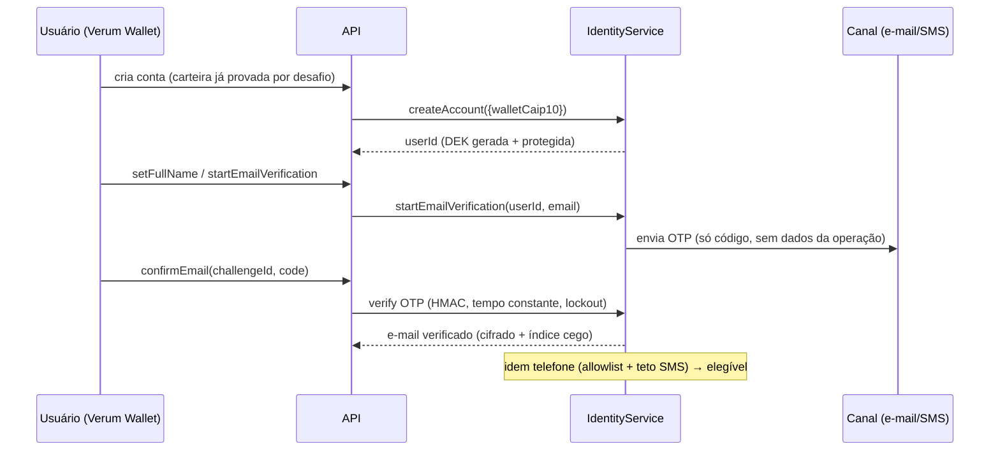
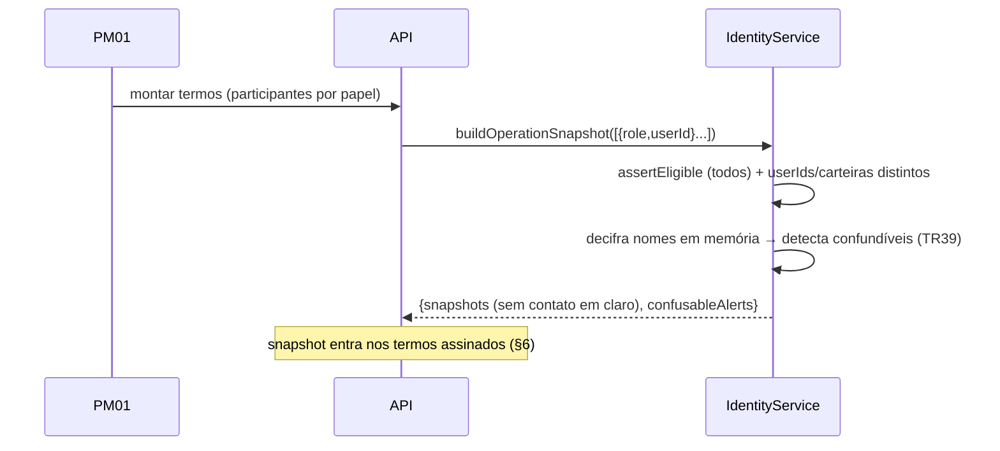

# VERUM OTC — Identidade Mínima (KYC-lite): ADRs, ameaças e diagramas

Módulo entregue nesta fase: **`src/identity/`** (crypto, normalize, otp, store, types, service, redaction) +
suíte de segurança `test/identity.test.ts` (23 testes) + códigos de erro `RATE_LIMITED`/`NOT_ELIGIBLE`.
Integra-se ao repositório existente (Fastify/PGlite/AuditLog) sem quebrar testes (108 passam no total).

---

## ADRs (contexto → decisão → consequência)

**ADR-001 · Módulo autocontido atrás de adapters.**
Contexto: o repo usa store em memória/arquivo e `node:crypto`; não há Redis/Postgres-KMS ligados.
Decisão: implementar identidade autocontida atrás de interfaces (`Kms`, `OtpChannel`, `IdentityStore`, `now()`),
com implementações locais (`LocalKms`, `FakeEmail/SmsChannel`, `InMemoryIdentityStore`) idênticas em contrato às de produção.
Consequência: dev/testes determinísticos e sem I/O externo; migrar para AWS KMS/Redis/Postgres é trocar o adapter, não o serviço.

**ADR-002 · Só 4 elementos de identidade; nível `BASIC`.**
Decisão: armazenar apenas carteira (pública), nome, e-mail e telefone. `verificationLevel` existe como enum de valor
único `BASIC` (gancho de extensibilidade). Consequência: teste de schema (`ACCOUNT_COLUMNS`) e de DTOs falha se surgir
qualquer PII adicional (CPF, foto, endereço residencial, geo, etc.).

**ADR-003 · Cifragem de campo por envelope + índice cego.**
Decisão: AES-256-GCM com uma DEK por usuário protegida pelo KMS; busca exata por HMAC-SHA256 (chave separada).
Consequência: banco vazado não revela nome/e-mail/telefone; busca por igualdade continua possível sem decifrar.

**ADR-004 · Crypto-shredding para exclusão.**
Decisão: apagar destrói a DEK (`wrappedDek=null`, `status='shredded'`); os blobs cifrados tornam-se ilegíveis.
Consequência: "direito ao esquecimento" sem furar a auditoria WORM append-only (a cadeia de hash permanece íntegra).

**ADR-005 · OTP não é fator de login.**
Decisão: OTP verifica posse de contato; a carteira é o único fator forte (alinhado à autenticação por desafio já
existente em `src/wallet/auth.ts`). Consequência: invadir e-mail não dá acesso à conta OTC; scanners de e-mail não
consomem "login". Sem senha, sem TOTP, sem magic link como login.

**ADR-006 · Confundíveis por esqueleto TR39 pragmático.**
Decisão: `confusableSkeleton` (NFKD + remoção de acentos + mapa de homoglifos aplicado antes do casefold + `rn→m`).
Consequência: "João Silva" e "Joao SiIva" colidem e geram alerta no snapshot; risco residual: cobertura de homoglifos
é curada, não a tabela TR39 completa (ampliável sem mudar a API).

**ADR-007 · Snapshot de identidade sem valores de contato.**
Decisão: o snapshot congelado nos termos leva `{role,userId,walletCaip10,fullName,emailVerifiedAt,phoneVerifiedAt}` —
datas de verificação, nunca e-mail/telefone em claro. Consequência: minimiza PII no que é assinado (§6).

**ADR-008 · Redação de logs por chave e por padrão.**
Decisão: `redact()` limpa por nome de chave sensível e por regex de e-mail/telefone; telefone só casa como token
isolado (lookarounds), para não confundir dígitos de endereços de carteira (públicos) com PII.
Consequência: `containsPersonalData` alimenta o teste que falha se PII aparecer em log/auditoria.

**ADR-009 · Erros de identidade com status HTTP não-401/403 quando fizer sentido.**
Decisão: `RATE_LIMITED→429`, `NOT_ELIGIBLE→403`, reaproveitando o `HTTP_STATUS` central. Consequência: o cliente
distingue "inelegível/limite" de "sessão inválida" (que redireciona ao login).

---

## Matriz de ameaças (STRIDE) — parte coberta por esta fase

| Ameaça | Controle | Arquivo/módulo | Teste que prova |
|---|---|---|---|
| Enumeração de contas (e-mail/telefone) | Unicidade e verificação por índice cego; erro uniforme "já em uso" | `service.ts`, `store.ts`, `crypto.blindIndex` | *Unicidade por blind index* |
| Vazamento de banco (PII) | Cifragem de campo por envelope (AES-256-GCM + DEK/KMS) | `crypto.ts`, `service.ts` | *Schema — blobs não contêm valor original* |
| Impersonação por nome parecido | Esqueleto de confundíveis TR39 + alerta no snapshot | `normalize.confusableSkeleton`, `service.buildOperationSnapshot` | *Detecção de impersonação* |
| Força bruta de OTP | 6 dígitos CSPRNG, HMAC, compare tempo-constante, lockout após 5, TTL | `otp.ts`, `crypto.hashOtp` | *OTP — bloqueio após 5 tentativas* |
| SMS pumping / abuso de custo | Allowlist de país + teto diário + rate limit de envio | `service.startPhoneVerification`, `normalize.phoneCountryAllowed` | *SMS — allowlist e teto diário* |
| Conta sem verificação entra em operação | Gate de elegibilidade (4 fatores + janela de reverificação) | `service.eligibility/assertEligible` | *Elegibilidade e reverificação* |
| Conluio / mesmo agente em 2 papéis | userIds e carteiras distintos no snapshot (cobre PM01≠PM02) | `service.buildOperationSnapshot` | *Snapshot — regras de participantes* |
| Vínculo de endereço não possuído | Endereço de liquidação exige prova de posse + unicidade global | `service.addSettlementAddress` | *Endereço de liquidação* |
| Engenharia social p/ trocar dados | Bloqueio durante operação ativa; carência de 72h na perda; multi-prova | `service.change*/recovery*` | *Trocas controladas* |
| PII em logs/auditoria | Redação por chave/padrão; payloads de auditoria só com referências | `redaction.ts`, `service.log` | *Redação de logs* / *auditoria sem PII* |
| Adulteração de exclusão vs. trilha | Crypto-shredding preserva a cadeia de hash da auditoria | `service.cryptoShred`, `AuditLog.verify` | *Crypto-shredding e auditoria íntegra* |

---

## Diagramas de sequência (fluxos entregues)

### Onboarding + verificação de contato


### Congelamento do snapshot de identidade da operação


### Troca de carteira perdida (carência 72h)
```mermaid
sequenceDiagram
  participant U as Usuário
  participant API
  participant ID as IdentityService
  U->>API: iniciar recuperação (OTP e-mail + OTP telefone)
  API->>ID: initiateLostWalletRecovery (bloqueia se op. ativa)
  ID-->>U: readyAt = agora + 72h (notifica contatos antigos)
  U->>API: concluir com nova carteira
  API->>ID: completeLostWalletRecovery
  ID-->>API: rejeita se antes de readyAt; senão troca a carteira
```

---

## Contrato de API (zod) — DTOs desta fase
`SetNameInput{fullName}`, `StartEmailInput{email}`, `StartPhoneInput{phone}`,
`ConfirmContactInput{challengeId,code}`, `AddSettlementInput{caip10}` — todos `.strict()` (em `src/identity/types.ts`),
provados livres de PII proibida pelo teste de DTOs. A exposição via rotas Fastify e o OpenAPI 3.1 completo seguem na
fase de integração de rotas (abaixo).

---

## Estado da entrega e bloqueadores (honestidade sobre limites)

**Entregue, completo e testado (112 testes passando, 0 quebrados; typecheck e lint limpos nos arquivos do módulo):**
identidade mínima (§2), verificação de contato por OTP com anti-abuso (§10 parte), cifragem de campo + blind index +
crypto-shredding + redação de logs (§8 parte), snapshot de identidade + confundíveis (§2/§6 parte), trocas controladas
e carência de 72h (§4), erros/HTTP.
**Rotas do portal + OpenAPI 3.1 (ENTREGUE):** `IdentityService` montado no `app.ts` (adapters locais de OTP;
`IDENTITY_MASTER_SECRET`/`CONTACT_REVERIFY_DAYS`/`SMS_*` em `config.ts`), rotas `GET/POST /v1/identity/*` ancoradas na
sessão de carteira do `WalletAuth`, endereço de liquidação com prova de posse reusando `auth.verify`, spec em
`GET /v1/identity/openapi.json` (`src/api/identityOpenapi.ts`); integração provada por `test/identity.api.test.ts` (4 testes).
Persistência de identidade em memória nesta fase (adapter Postgres é troca de `IdentityStore`) — risco residual declarado.

**Salas e convites §5 (ENTREGUE):** `src/rooms/` (`RoomService`, tipos, wordlist) + rotas `/v1/rooms/*` + WebSocket
`/v1/rooms/:id/stream` + OpenAPI. Token de convite opaco de 256 bits guardado só como SHA-256, uso único, TTL 30min,
vinculado a {sala, papel, convidado/índice de contato}; entregue ao PM01 (frontend usa o fragmento `#t=` e envia por
POST — nunca em GET). Anti-enumeração (resposta idêntica exista ou não a conta). Aceite = sessão do destinatário +
consumo atômico do token + assinatura de ingresso verificada por rede. Ticket de WS de uso único (TTL 30s) via
subprotocolo `Sec-WebSocket-Protocol` (fora da URL/logs) + validação de Origin + autorização por sala + zod + heartbeat.
Encerramento irreversível (revoga convites, barra mensagens/tickets). Impressão digital de 6 palavras PT do termsHash.
Provado por `test/rooms.test.ts` (12) + `test/rooms.api.test.ts` (2). Persistência em memória (adapter Postgres futuro).
ADR-R1: ticket de WS no subprotocolo (não em query) para não vazar em logs/Referer; a lógica de segurança
(consumeWsTicket/validateOrigin/authorizeRoomMessage) é testada unitariamente e reusada pela rota WS.

**Propostas estruturadas de termos §5.3/§6 (ENTREGUE):** `src/proposals/service.ts` (`ProposalService`) + rotas
`/v1/deals/:id/proposals[...]` + OpenAPI. Mudança TIPADA e validada (`discount|commission|amount|expiry`, união
discriminada `strict` — nunca texto livre). Propor (qualquer participante) → preview do impacto (diff + nº de assinaturas
a invalidar). Aplicar (SÓ o criador, via `assertCreator` do `amend`) aciona a máquina de estados já congelada:
`amend` faz version++ e marca as assinaturas como `superseded`; em seguida `open` retorna a `AWAITING_SIGNATURES` para
reassinatura. Propostas concorrentes viram `stale`. Anti-replay entre versões é garantido pelo binding de revisão do
engine. `ProposalService` NÃO reimplementa a invalidação (delega ao `DealEngine` — respeita a máquina congelada).
Provado por `test/proposals.test.ts` (3) + a cobertura existente `engine.test.ts:133`.

**PWA §7 (ENTREGUE):** `src/api/pwa.ts` (manifest, service worker, ícones SVG, offline) + rotas same-origin
(`/manifest.webmanifest`, `/sw.js`, `/icons/verum[-maskable].svg`, `/offline.html`) + injeção de `<link rel=manifest>`,
theme-color, apple-touch-icon e registro do SW nas páginas servidas. **ADR-P1 (segurança):** o SW é network-first para
navegações (não persiste HTML autenticado) e **jamais** cacheia `/v1`, `/ops`, `/metrics` ou requisições com
`Authorization` — só um shell estático mínimo (offline + ícone + manifest), alinhado a §7/§8. Compatível com o CSP
estrito (tudo same-origin; SW via worker-src→default-src 'self'; registro inline via script-src 'unsafe-inline').
Provado por `test/pwa.test.ts` (3). Risco residual: ícones são SVG; para instalação plena no iOS recomenda-se também
apple-touch-icon PNG (polimento de produção).

**Sequenciado (não entregue nesta fase — declarado, não "stubbado"):**
- §3 endurecimento de auth (SIWE/SIWS/BIP-322, nonce GETDEL Redis, Universal/App Links, cookie `__Host-sid`) — a base
  de desafio existe em `src/wallet/auth.ts` e já é reusada nas rotas de identidade, no aceite de salas e no aceite de propostas; falta o pacote completo.
- §6 canonicalização/assinatura EIP-712/legível dos termos ligada ao contrato (parte já em `src/engines/signature.ts`).
- §6 assinatura EIP-712/legível ligada ao contrato — parte já existe em `src/engines/signature.ts`.
- §7 frontend (marca d'água forense, overlay, CSP com nonce/Trusted Types).
- §9 WORM em Postgres (REVOKE + trigger) — o encadeamento por hash já existe em `src/audit/audit.ts`; falta o DDL.
- OpenAPI 3.1 completo e matriz STRIDE das seções acima.

**Riscos residuais (não elimináveis):**
screenshot do SO e câmera externa não são bloqueáveis por navegador (tratar como dissuasão + rastreabilidade forense);
SIM swap é mitigado (telefone não é fator de login; multi-prova + carência) mas não eliminado; conluio entre
participantes é detectável/auditável, não impedível; se o SDK da carteira só exibir hash, a assinatura legível vira
bloqueador de produção (§6).
