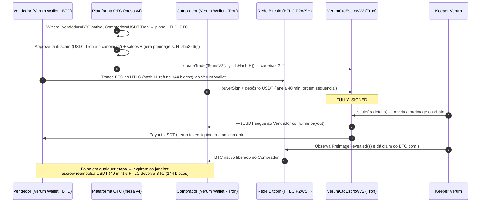

# ADR v4 — Escrow dinâmico (2–4 cadeiras), BTC nativo via HTLC, roteamento cross-chain e anti-scam

Status: proposto (backend + wizard já implementados neste repo; Solidity destinado ao repo `verum-otc-onchain`).

## Contexto

A v3 exige exatamente 4 carteiras no escrow, as duas pernas na mesma rede e BTC apenas como
representação tokenizada (WBTC/cbBTC). A v4 remove os três gargalos e adiciona verificação
anti-scam de tokens na aprovação. **O código Solidity abaixo pertence ao repo `verum-otc-onchain`**
(aqui só chega espelho gerado via `scripts/sync-onchain.mjs`); os trechos são a especificação
de referência para o PR naquele repo.

## 1. Escrow dinâmico — 2, 3 ou 4 cadeiras (Solidity)

Hoje: `PARTICIPANT_COUNT = 4` travado (`validateParticipants` exige 4 endereços distintos e a
tupla `Terms` tem `paymaster01/paymaster02` obrigatórios). Mudança: participantes viram um array
de 2–4 com papéis explícitos, mantendo a ordem de assinatura SELLER → PM1 → PM2 → BUYER
(papéis ausentes são pulados).

```solidity
// VerumOtcEscrowV2.sol — trechos principais (repo verum-otc-onchain)

enum Role { SELLER, PAYMASTER_1, PAYMASTER_2, BUYER }

struct Participant { address wallet; Role role; }

struct TermsV2 {
    Participant[] participants;   // 2..4, papéis únicos, SELLER e BUYER obrigatórios
    address sellerAsset;  uint256 sellerAmount;
    address buyerAsset;   uint256 buyerAmount;
    uint16 platformFeeBps; uint16 commissionBps; uint16 discountBps; uint16 slippageBps;
    uint64 createdAt; uint64 expiresAt;      // expiresAt == createdAt + TRADE_DURATION (2400s)
    uint32 termsVersion;                     // == 2
    uint256 nonce;
    bytes32 htlcHash;                        // 0x0 = sem perna HTLC; != 0x0 = settle condicionado à preimage
}

uint8 constant MIN_PARTICIPANTS = 2;
uint8 constant MAX_PARTICIPANTS = 4;

function _validateParticipants(Participant[] calldata ps) internal pure {
    require(ps.length >= MIN_PARTICIPANTS && ps.length <= MAX_PARTICIPANTS, "PARTICIPANTS_2_TO_4");
    bool hasSeller; bool hasBuyer; bool hasPm1; bool hasPm2;
    for (uint256 i; i < ps.length; ++i) {
        require(ps[i].wallet != address(0), "ZERO_WALLET");
        for (uint256 j = i + 1; j < ps.length; ++j) require(ps[i].wallet != ps[j].wallet, "DUP_WALLET");
        if (ps[i].role == Role.SELLER)      { require(!hasSeller, "DUP_ROLE"); hasSeller = true; }
        else if (ps[i].role == Role.BUYER)  { require(!hasBuyer,  "DUP_ROLE"); hasBuyer  = true; }
        else if (ps[i].role == Role.PAYMASTER_1) { require(!hasPm1, "DUP_ROLE"); hasPm1 = true; }
        else                                 { require(!hasPm2, "DUP_ROLE"); hasPm2 = true; }
    }
    require(hasSeller && hasBuyer, "SELLER_AND_BUYER_REQUIRED");
    require(!hasPm2 || hasPm1, "PM2_REQUIRES_PM1");   // 4ª cadeira só com a 3ª
}

/// Ordem de assinatura dinâmica: papéis presentes, na ordem canônica; ausentes são pulados.
function _nextSigner(TradeV2 storage t) internal view returns (Role) {
    Role[4] memory order = [Role.SELLER, Role.PAYMASTER_1, Role.PAYMASTER_2, Role.BUYER];
    for (uint256 i; i < 4; ++i) {
        if (!_hasRole(t, order[i])) continue;          // mesa de 2/3 cadeiras pula o papel ausente
        if (!t.signed[uint8(order[i])]) return order[i];
    }
    revert("FULLY_SIGNED");
}

function createTrade(TermsV2 calldata terms, WalletAttestation[] calldata atts) external returns (bytes32 tradeId) {
    _validateParticipants(terms.participants);
    require(atts.length == terms.participants.length, "ATTESTATION_PER_PARTICIPANT");
    // … validações de ativos/economia/timestamps idênticas à v1 (expiresAt = createdAt + 2400) …
}

/// settle: com perna HTLC, a liberação exige a preimage — é ela que destrava o BTC do outro lado.
function settle(bytes32 tradeId, bytes calldata preimage) external {
    TradeV2 storage t = _trade(tradeId);
    require(t.state == State.FULLY_SIGNED, "NOT_READY");
    if (t.terms.htlcHash != bytes32(0)) {
        require(sha256(preimage) == t.terms.htlcHash, "BAD_PREIMAGE");
        emit PreimageRevealed(tradeId, preimage);     // observado pelo keeper → claim do BTC
    }
    _payout(t);                                        // duas pernas atômicas, como na v1
}
```

Invariantes preservadas: janela fixa de 40 min, `platformFeeBps` fixo, ordem sequencial, refund
pós-expiração para os depositantes originais. Migração: contrato novo (V2) lado a lado; o
`sync-onchain` passa a gerar `types.ts` com `participants[]` e `htlcHash`; o adapter
(`src/adapters/verum/common.ts`) monta `TermsV2` a partir das cadeiras presentes — a trava
`PARTICIPANT_COUNT = 4` e o `paymaster02` “fantasma” deixam de existir.

## 2. BTC nativo via HTLC (atomic swap)

O BTC nunca entra no escrow EVM — ele fica num **HTLC P2WSH na rede Bitcoin** com o MESMO
`sha256(preimage)` registrado no escrow (`terms.htlcHash`). Script de referência:

```
OP_IF
    OP_SHA256 <hash> OP_EQUALVERIFY <pubkey_comprador> OP_CHECKSIG      # claim com a preimage
OP_ELSE
    <144> OP_CHECKSEQUENCEVERIFY OP_DROP <pubkey_vendedor> OP_CHECKSIG  # refund após ~24h
OP_ENDIF
```

Regras de segurança (assimetria de prazos é o coração do swap):
- Timelock do BTC (144 blocos ≈ 24h) ≫ janela do escrow (40 min): quem revela a preimage no
  `settle` do token sempre tem folga para dar claim no BTC antes do refund do vendedor.
- A preimage é gerada pela plataforma na APROVAÇÃO, entra no `termsHash` congelado como
  `sha256(preimage)` e só é usada no settle; o keeper observa `PreimageRevealed` e completa o claim.
- Verum Wallet assina a transação de lock BTC do lado que vende BTC (ela já gerencia BTC nativo).

Backend neste repo (implementado): `src/mesa/settlementPlan.ts` deriva `HTLC_BTC` quando uma das
cadeiras SELLER/BUYER é `{ network: 'bitcoin', contractOrMint: null }`; o wizard oferece
“Bitcoin (BTC nativo · HTLC)” como rede do lado e o plano aparece no passo 2, na revisão e no
detalhe da mesa (`settlement` no DTO).

## 3. Roteamento cross-chain (USDT Polygon ↔ USDT Tron)

Escolha: **Chainlink CCIP** como transporte primário (finality-aware, token pools auditados,
Risk Management Network independente); LayerZero V2 como fallback de rota quando o lane CCIP
não existir (ex.: Tron). Arquitetura **lock-and-message**, nunca bridge de custódia:

1. Cada perna é travada no escrow DA SUA rede (duas instâncias do VerumOtcEscrowV2 com o mesmo
   `tradeId`/`termsHash`).
2. Concluídas as assinaturas, o escrow de origem emite `SettleAuthorized(tradeId, termsHash)`;
   o `VerumSettlementRouter` (contrato fino por rede) envia a mensagem CCIP para o escrow da
   outra rede, que valida `termsHash` e executa o payout local.
3. Timeout da mensagem (ex.: 30 min sem ACK) → ambos os lados caem em refund — nenhum lado
   libera sem o outro ter autorização registrada.
4. Tron hoje não tem lane CCIP: a rota Polygon↔Tron usa o keeper da plataforma como relayer
   assinante (multisig + prova do evento de origem), com o MESMO protocolo de mensagem — trocável
   por lane nativo quando existir.

Backend neste repo (implementado): `deriveSettlementPlan` marca `CROSS_CHAIN` + `bridge: 'CCIP'`
quando as redes das pernas diferem; o wizard permite rede por lado e exibe o plano.

## 4. Anti-scam de tokens (implementado neste repo)

`src/mesa/antiscam.ts`: no `POST /v1/portal/mesas/:id/approve`, ANTES de qualquer validação de
saldo, cada ativo de SELLER/BUYER passa por camadas compostas:
1. `registryChecker` — símbolo conhecido (USDT/USDC/WBTC/…) na rede + contrato divergente do
   endereço canônico de `registryData.ts` → **403 FORBIDDEN** com motivo nominal.
2. `verumWalletChecker` — consulta `VERUM_WALLET_SECURITY_URL /v1/token-security` (lista viva de
   tokens maliciosos da Verum Wallet); veredito `malicious` → 403.
Nativo (BTC HTLC) e tokens desconhecidos do registro passam (modo avançado continua possível);
auditoria registra `mesa.aprovacao.token_scam`.

## Fluxo ponta-a-ponta: Vendedor BTC nativo × Comprador USDT Tron



## Sequenciamento

1. (feito aqui) Backend: cadeiras 2–4 no domínio, `settlementPlan`, anti-scam no approve, wizard.
2. PR no `verum-otc-onchain`: `VerumOtcEscrowV2` (participants[] + htlcHash) + testes foundry + deploy testnets.
3. `sync-onchain` + adapters: `buildVerumTermsV2` com papéis presentes; keeper de preimage/claim BTC.
4. `VerumSettlementRouter` + lanes CCIP (EVM↔EVM) e relayer assinado (Tron) — testes de timeout/refund.
